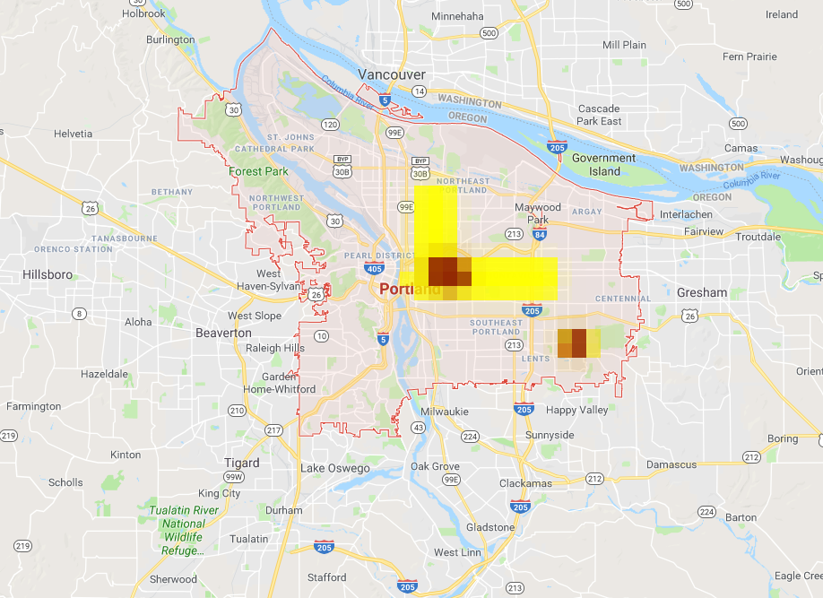

# pudl-heatmap
Capstone Project

Generates a heatmap based on Trimet arrival data to visualize timeliness and local delays.

## Architecture and Technology

Data will be queried from the TriMet GTFS feeds via a Google Cloud Function. Relevant details will then be transformed if necessary and recorded in a Google Cloud Firestore database. Part of our evaluation will be to show a cost comparison on both developer and infrastructure resources compared to a more traditional web application hosted on university hardware.

## Milestones

### First Step

* Pull the data for a single route/stop and display a marker indicating on time or late arrival estimated (or not estimated).

* This will show successful setup of both the TriMet application ID and Google Cloud Project.

## Questions

* How will data for multiple buses be displayed?
  - The user could indicate a route they were interested in but this limits the overall "dashboard" functionality.
  - The color could be based on some combining of routes where a "hotter" color indicated a large portion of buses for that area delayed. This changes the original idea of "hotter" colors indicating larger delays.

* What data should be persisted to the database?
  - Plan this out in a way that won't prevent the stetch goals from being attempted.

## Stretch Goals

* Historical playback of previous intervals (animating the heatmap to watch traffic)

## Links

* [PUDL Heatmap](https://pudl-heatmap.appspot.com/)
* [Trimet GTFS](https://developer.trimet.org/GTFS.shtml)
* [Google Cloud Functions](https://cloud.google.com/functions/)
* [Google Cloud Firestore](https://cloud.google.com/firestore/)
